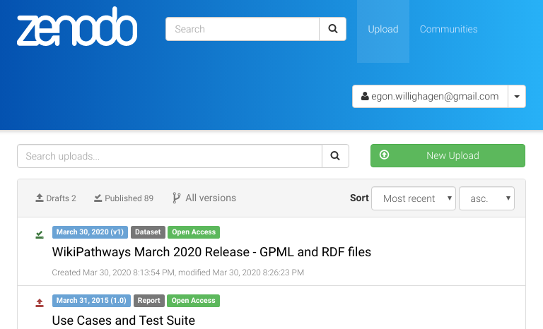

# Make your Research Findable

[prev](SpreadsheetAnnotation2.md) | [toc](./README.md) | [next](rdf.md)

---

## Literature and *keyword* annotation

Before we jump to the exercise, first a few pointers.
Scholia is a graphical user interface that visualizes data from the Wikidata knowledgebase.
Wikidata is a project under the umbreally of the Wikimedia Foundation and therefore a sister
project of Wikipedia [[0](https://elifesciences.org/articles/52614)].
Scholia uses web technologies to visualize the results queried
from Wikidata with the SPARQL query language [[1](https://riojournal.com/article/35820/)].

Like in the previous exercise, we start with an ontology code for `JRCNM01101a`: `ENM_9000086`.

### Searching in Scholia

* Step 1: Visit [https://tools.wmflabs.org/scholia/](https://tools.wmflabs.org/scholia/)
* Step 2: Search `ENM_9000086`

#### Questions

1. The URL contains the Wikidata Q-identifier. What is it? <button onclick="toggleAnswer('q1')">Answer</button>Q47462008
2. How many articles does Scholia show for `JRCNM01101a`? <button onclick="toggleAnswer('q2')">Answer</button>At the time of writing: four.
3. Which four journals have these articles appeared in? <button onclick="toggleAnswer('q3')">Answer</button>Toxicology in Vitro, Scientific Reports, Regulatory Toxicology and Pharmacology, and PLoS ONE.

### Linking your article in Wikidata to 'main subjects'

Like Wikipedia, everyone can edit Wikidata (and like Wikidata, spam and vandalism is actively detected).
The above example takes advantage of the linking of research papers and the topics they are about,
very much like how PubMed used MeSH terms.

For example, if we take [this nanosafety article](https://doi.org/10.1016/J.YRTPH.2017.09.029) and look up
the [entry in Wikidata](https://www.wikidata.org/wiki/Q47462001), we see something like this:

And if we scroll down we can see the 'main topic' annotation:

You are encouraged to annotate your own article as well. If you have the DOI of your article,
you can check with this URL pattern: http://scholia.toolforge.org/doi/HERE_YOUR_DOI where
all characters in the "HERE YOUR DOI" should be upper case.

If your article is missing, [fill out this form](https://forms.gle/uKmwm9MBFamY4sHJ6) and check
again tomorrow.

## Make your data more findable

Well, this is the perhaps one of the simplest steps. The easiest way is to upload your data
to [Figshare](https://figshare.com/), [Zenodo](https://zenodo.org/), or an institutional repository.

The process is basically the same. First, you login on the service, where Zenodo allows you to
log in with your ORCID:

After you logged in, follow the [Upload link](https://zenodo.org/deposit) and the instructions shown:

## Announcing your data with the EU NanoSafety Cluster

The last step is to announce your new (or old) data deposit with the EU NanoSafety Cluster
(if you participate in one of the associated projects). You can do that simply by providing the
new DOI with [this submission form](https://www.nanosafetycluster.eu/outputs/public-deliverables-publications/), which looks like this:

---

[prev](SpreadsheetAnnotation2.md) | [toc](./README.md) | [next](rdf.md)

Copyright 2020 (C) Egon Willighagen - CC-BY Int. 4.0
