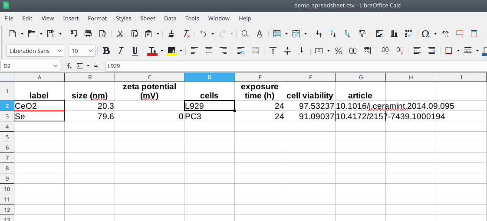

# Spreadsheet Annotation

[toc](./README.md) | [next](SpreadsheetAnnotation2.md)

---

## A Demo Spreadsheet

In this first hackathon we start by looking at a simple spreadsheet with some minimal information. Actually,
it is data from a recent publication by Labouta *et al.*, where the authors made their data collection available under an Open license:

This spreadsheet shows a number of concepts and experimental data. We see nanomaterials, physicochemical properties,
and a bit of biological assay data. We see that columns can be annotated ("all data in this column is particle sizes")
and we note that cell values may need annotation (such as the cell lines).

The data is available in two formats:

* [Tab-Separated Values](demo_spreadsheet.tsv)
* [Microsoft Excel](demo_spreadsheet.xlsx)

### Exercise 1: Browsing the eNanoMapper ontology with BioPortal

The purpose of this exercise is to see how BioPortal visualizes the eNanoMapper ontology.
A [detailed tutorial](https://enanomapper.github.io/tutorials/BrowseOntology/Tutorial%20browsing%20eNM%20ontology.html)
has been developed before.

Your task is to find the ontology term for JRCNM01000a, one of the
JRC representative industrial nanomaterials (see [[0](https://doi.org/10.1016/J.YRTPH.2016.08.008)]).

* Step 1: Visit [http://bioportal.bioontology.org/ontologies/ENM/](http://bioportal.bioontology.org/ontologies/ENM/)
* Step 2: Open the Classes tab
* Step 3: Search `JRCNM01000a`

#### Questions

1. What is the ontology term IRI for JRCNM01000a? <button onclick="toggleAnswer('q1')">Answer</button> http://purl.enanomapper.org/onto/ENM_9000074
2. What is the ontology super class of this term? And the IRI of that?<button onclick="toggleAnswer('q2')">Answer</button> titanium oxide nanoparticle, http://purl.bioontology.org/ontology/npo#NPO_1486

## Annotating the columns

When we look at the column headers, we see the following concepts:

* label (name)
* particle size
* zeta potential (experimental?)
* cell line
* exposure time
* cell viability
* journal article

In this part of the workshop, the annotation will result in written documentation: you just write down
which ontologies term match which cells in the spreadsheet.

### Exercise 2: Use BioPortal to find matching ontology terms

In this excercise your task is to find the ontology term for the concepts of the columns.
It is suggested to first search in the eNanoMapper (ENM) ontology. If you cannot find a hit,
go to the BioPortal front page and search in all ontologies.

* Step 1: Visit [http://bioportal.bioontology.org/ontologies/ENM/](http://bioportal.bioontology.org/ontologies/ENM/)
* Step 2: Open the Classes tab
* Step 3: Search for the concept represented by the column

#### Questions

1. What is the ontology term IRI for `label`? <button onclick="toggleAnswer('q3')">Answer</button> It is not http://purl.obolibrary.org/obo/CHEBI_35209, which is reserved to chemical groups that are used as tracer, such as fluorescent groups. 'Name' is in the eNanoMapper ontology with IRI 	
http://ncicb.nci.nih.gov/xml/owl/EVS/Thesaurus.owl#C42614 and that is a good fit. Arguable, 'molecular entity name' is a better match, as it has more semantic meaning.
2. 

## Annotating the values

Besides the columns themselves, we also noted that two columns have values which we may want to annotation.
We see that the label and cell columns have values which we can find in ontologies too. The eNanoMapper and
NanoParticle Ontologies will have terms for the nanomaterials, whereas the eNanoMapper ontology also has
terms for the cell lines.

### Exercise 3: Use BioPortal to find matching ontology terms

The procedure is the same as before.

#### Questions

1. What is the ontology term IRI for CeO2? <button onclick="toggleAnswer('q10')">Answer</button> http://purl.enanomapper.org/onto/ENM_9000006
2. What is the ontology term IRI for Se? <button onclick="toggleAnswer('q11')">Answer</button> http://purl.enanomapper.org/onto/ENM_9000244

## Annotating the value units

Finally, the spreadsheet also lists a few units (mV, nm). It is left to the participant to look these up
in ontologies. Here, the [Units of Measurement Ontology](http://bioportal.bioontology.org/ontologies/UO/)
(UO) might be useful.

## References

* Labouta HI, Asgarian N, Rinker K, Cramb DT. Meta-Analysis of Nanoparticle Cytotoxicity via Data-Mining the Literature. ACS Nano. 2019 Jan 31; doi:[10.1021/acsnano.8b07562](https://doi.org/10.1021/acsnano.8b07562) ([Scholia](https://tools.wmflabs.org/scholia/work/Q69534939))

---

[toc](./README.md) | [next](SpreadsheetAnnotation2.md)

Copyright 2019-2020 (C) Egon Willighagen - CC-BY Int. 4.0
