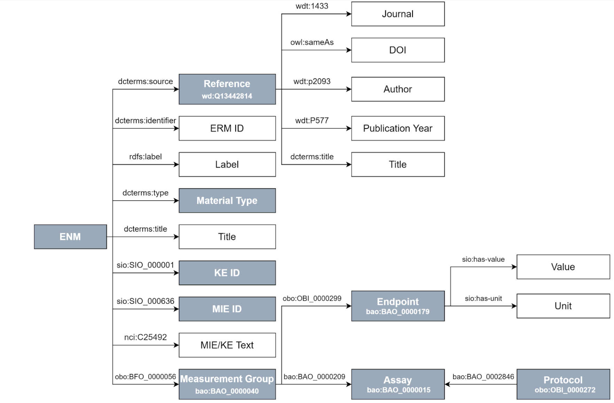

# Querying the Nanosafety RDF

[prev](README.md)

<script>
  function toggleAnswer(id) {
  var answer = document.getElementById(id);
  if (answer.style.visibility === "hidden" ||
      answer.style.visibility === "none") {
    answer.style.visibility = "visible";
  } else {
    answer.style.visibility = "hidden";
  }
}
</script>


## Introduction

Adverse Outcome Pathways (AOPs) have been proposed to explore interactions of chemicals/materials with biological systems. Each AOP starts with a molecular initiating event (MIE) and possibly ends with adverse outcome(s). So far, we do not fully understand how many nanomaterials interact with proteins, biomembranes, cells, and biological structures in general. There is limited insight into the toxicology-related key events (KEs) they trigger, such as oxidative stress and inflammation, or the biological processes underlying these KEs. For this SPARQL endpoint we integrate the annotation of nanomaterials and their MIEs with ontology annotation to demonstrate how we can then query AOPs and biological pathway information for these materials. 

## Figure of RDF schema

<figure>
    
    <figcaption>Graphical representation of the Resource Description Framework Schema for nanomaterials (NMs)<\figcaption>
<\figure>


## Exercises

### Exercise 1 - listing of subjects
This first exercise is about creating simple SPARQL queries that list particular types of subjects in the RDF. See the example SPARQL query below to see the KE identifiers in the Nanosafety RDF.

```SPARQL
PREFIX sio: <http://semanticscience.org/resource/>

select distinct ?KE where { 
    ?s sio:SIO_000001 ?KE .
}
```

When copying this SPARQL query and executing it, you will see the KE id's that are mentioned in the Nanosafety RDF. Of course these are hard to interpret. In the RDF schema you can see that the RDF also contains an MIE/KE text. This is the name of the KE as mentioned in the paper.

Modify the above query to select the MIE/KE text. Which predicate do you use? <button onclick="toggleAnswer('nsrdfq1')">Answer</button><span id="nsrdfq1" style="visibility: hidden">nci:C25492</span>

### Exercise 2 - counting of subjects

To get an overview of what is in the RDF you can create a number of queries to count thing. For example, how many distinct ERM identifiers are mentioned in the RDF? <button onclick="toggleAnswer('nsrdfq2a')">Answer</button><span id="nsrdfq2a" style="visibility: hidden">87</span>
  
  And how many publications? <button onclick="toggleAnswer('nsrdfq2b')">Answer</button><span id="nsrdfq2b" style="visibility: hidden">21</span>
  
  Can you count the number of endpoints? <button onclick="toggleAnswer('nsrdfq2c')">Answer</button><span id="nsrdfq2c" style="visibility: hidden">7</span>
  
  How to count distict instances? Here is a hint: <button onclick="toggleAnswer('hint1')">HINT</button><span id="hint1" style="visibility: hidden">use COUNT(DISTINCT ?id as ?nid)</span>

  
### Exercise 3 - going one step further

As you can see in the RDF schema above you can extract information from the RDF about which endpoints the 
  write a SPARQL query to list the endpoints mentioned in each paper (distinct DOI). Do all papers report all endpoints? <button onclick="toggleAnswer('nsrdfq3')">Answer</button><span id="nsrdfq3" style="visibility: hidden">No, quite a few only report 6 endpoints.</span>
  
### Exercise 4 - extracting values
  
  The following query show you information about thw medium in which the zeta potential is measure. 
  
  ```SPARQL
  PREFIX bao: <http://www.bioassayontology.org/bao#>
PREFIX obo: <http://purl.obolibrary.org/obo/>
PREFIX sio: <http://semanticscience.org/resource/>
PREFIX enm: <http://purl.enanomapper.net/>
PREFIX dcterms: <http://purl.org/dc/terms/>
PREFIX wd: <http://www.wikidata.org/prop/direct/>
PREFIX owl: <http://www.w3.org/2002/07/owl#>

select distinct ?mlabel ?doi ?measurement ?medium where {
  ?s rdfs:label ?mlabel ; 
     obo:BFO_0000056 ?mg .
  ?s dcterms:source ?source .
  ?source owl:sameAs ?doi .
  ?mg obo:OBI_0000299 ?o .
  ?o a bao:BAO_0000179 ;
       rdfs:label ?measurement ;
       rdfs:label "zeta potential"@en .
  optional{?o enm:has-condition ?g .}
  optional{?g rdfs:label ?medlabel
              ; sio:has-value ?medium .}
  #optional{value_range}
  #optional{value}
  #optional{unit}

} ORDER BY ?mlabel, ?doi
  ```
  Add the lines for value_range, value and unit, so that the query also provides you with the values of the zeta potential in the different media. HINT: the predicate for value_range is not shown in the figure and is obo:STATO_0000035.
 
  Run the query, what is the first material and value for the zeta potential if you ORDER BY the material name and DOI? <button onclick="toggleAnswer('nsrdfq4')">Answer</button><span id="nsrdfq4" style="visibility: hidden">6 TiO2 NP A (anatase/rutile) with a value of -8.92 +/- 0.75</span>

  
### Exercise 5 - 
In exercise 1 we looked at the KE id's that are mentioned in the Nanosafety RDF. Using a federated query to AOP wiki we can get the labels for these key events. 
  
  What is the label for KE https://identifiers.org/aop.events/1194? <button onclick="toggleAnswer('nsrdfq5')">Answer</button><span id="nsrdfq5" style="visibility: hidden">Increase, DNA damage</span>
  
Here is a hint: <button onclick="toggleAnswer('hint1')">HINT</button><span id="hint1" style="visibility: hidden">use SERVICE <https://aopwiki.rdf.bigcat-bioinformatics.org/sparql>{?mie dc:title ?mietitle .}</span>
